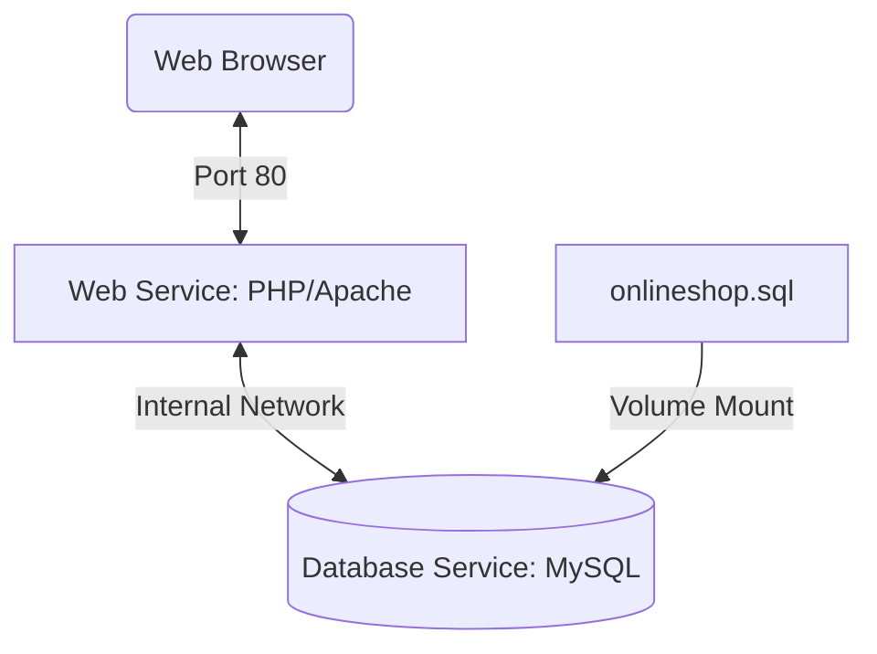

# Online Shopping System (Dockerized)

A containerized online e-commerce web application with separate user and admin panels. This project demonstrates a LAMP stack (PHP/MySQL) application modernized and simplified using Docker and Docker Compose for seamless deployment and development.

## Overview

This repository provides a fully functional online shopping system that eliminates the need for manual server configuration tools like XAMPP or WAMP. By leveraging Docker, the application and its database are orchestrated to launch quickly with a single command, automatically provisioning the database schema and sample data.

## Key Features

- **User Storefront**: Browse products, search, add to cart, and checkout.
- **Admin Dashboard**: Manage inventory, products, and user accounts.
- **Dockerized Environment**: Containerized web server (PHP 7.4 + Apache) and database (MySQL 5.7).
- **Automated Database Seeding**: The database structure and sample data are automatically populated on the first container startup.
- **Authentication**: Role-based access control separating regular users and administrators.

## Tech Stack

- **Containerization**: Docker, Docker Compose
- **Backend**: PHP 7.4
- **Web Server**: Apache
- **Database**: MySQL 5.7
- **Frontend**: HTML, CSS, JavaScript

## Architecture / Workflow



## Project Structure

```text
online-shopping-system-docker/
├── .github/              # GitHub Actions workflows
├── admin/                # Admin panel source code
├── css/                  # Stylesheets
├── database/             # Database initialization script (onlineshop.sql)
├── js/                   # Frontend JavaScript
├── product_images/       # Images for product catalog
├── Dockerfile            # Instructions for building the PHP/Apache image
├── docker-compose.yml    # Docker services configuration
├── index.php             # Main entry point for storefront
└── README.md             # Project documentation
```

## Prerequisites

- [Docker](https://docs.docker.com/get-docker/)
- [Docker Compose](https://docs.docker.com/compose/install/)

## Installation

1. **Clone the repository:**
   ```bash
   git clone https://github.com/Abdullah-Zuberi/online-shopping-system-docker.git
   cd online-shopping-system-docker
   ```

## Running the Project

1. **Start the containers using Docker Compose:**
   ```bash
   docker-compose up -d --build
   ```
   *This command builds the PHP web service, pulls the MySQL image, and automatically seeds the database.*

2. **Access the application:**
   - Storefront: Open your browser and navigate to `http://localhost`
   - Admin Panel: Accessible via `http://localhost/admin`

## Default Credentials

- **Admin Login:**
  - **Email / Username**: `admin@gmail.com` / `admin`
  - **Password**: `123456789`

## Configuration

The database configuration is managed within the `docker-compose.yml` file. Environment variables passed to the MySQL container define the setup:
- `MYSQL_DATABASE`: `onlineshop`
- `MYSQL_ALLOW_EMPTY_PASSWORD`: `yes`

*Note: This configuration is intended for development purposes only. Ensure robust credential management in production environments.*
